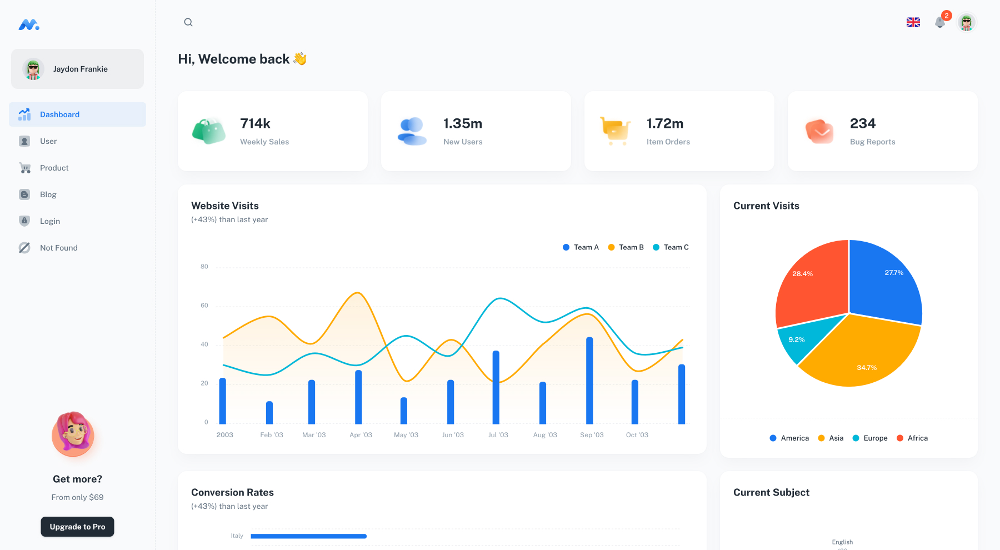

## Minimal [(Free version)](https://minimal-kit-react.vercel.app/)


> Free React Admin Dashboard made with Material-UI components and React.



## Demo

- [Dashboard Page](https://minimal-kit-react.vercel.app/)
- [Users Page](https://minimal-kit-react.vercel.app/user)
- [Products Page](https://minimal-kit-react.vercel.app/products)
- [Blog Page](https://minimal-kit-react.vercel.app/blog)
- [Login Page](https://minimal-kit-react.vercel.app/login)
- [Not Found Page](https://minimal-kit-react.vercel.app/404)

## Quick start

- [Download from Github](https://github.com/minimal-ui-kit/material-kit-react/archive/refs/heads/main.zip) or clone the repo : `git clone https://github.com/minimal-ui-kit/material-kit-react.git`
- Recommended `Node.js v18.x`.
- **Install:** `yarn install`
- **Start:** `yarn dev`
- **Build:** `yarn build`

## CICD

### Amazon S3 Static - Bucket Policy JSON

```json
{
    "Version": "2012-10-17",
    "Statement": [
        {
            "Sid": "PublicReadGetObject",
            "Effect": "Allow",
            "Principal": "*",
            "Action": "s3:*",
            "Resource": [
                "arn:aws:s3:::<bucket-name>",
                "arn:aws:s3:::<bucket-name>/*"
            ]
        }
    ]
}
```

### Amazon CodeBuild - Environment Variable

- Add environment variable: `S3_BUCKET` and set the value to your corresponding bucket name.
  - Sample:
    - Key: `S3_BUCKET`
    - Value: `s3://remit-rocket-cicd`
    - Type: `PLAINTEXT`

- Buildspec file:

```yml
version: 0.2

phases:
  install:
    commands:
      - echo "Installing dependencies..."
      - npm install

  build:
    commands:
      - echo "Building React app..."
      - npm run build
      
  post_build:
    commands:
      - echo "Uploading / Syncing to S3"
      - aws s3 sync ./dist $S3_BUCKET
```

### Amazon CodePipeline

- Add `Build` stage
  - Set `Trigger` to `no filter`.
- Skip `Deploy` stage
- Save changes

## Upgrade to PRO Version

| Minimal Free     | [Minimal Pro](https://material-ui.com/store/items/minimal-dashboard/) |
| :--------------- | :-------------------------------------------------------------------- |
| **6** Demo Pages | **70+** Demo Pages                                                    |
| -                | Authentication with **Amplify**, **Auth0**, **JWT** and **Firebase**  |
| -                | [+More components](https://minimals.cc/components)                    |
| -                | Dark & light mode                                                     |
| -                | Next.js version                                                       |
| -                | TypeScript version (Standard Plus and Extended license)               |
| -                | Design Figma File (Standard Plus and Extended license)                |
| -                | Complete Users Flows                                                  |
| -                | Learn more: [Package & License](https://docs.minimals.cc/package)     |

## License

Distributed under the MIT License. See [LICENSE](https://github.com/minimal-ui-kit/minimal.free/blob/main/LICENSE.md) for more information.

## Contact us

Email: support@minimals.cc
